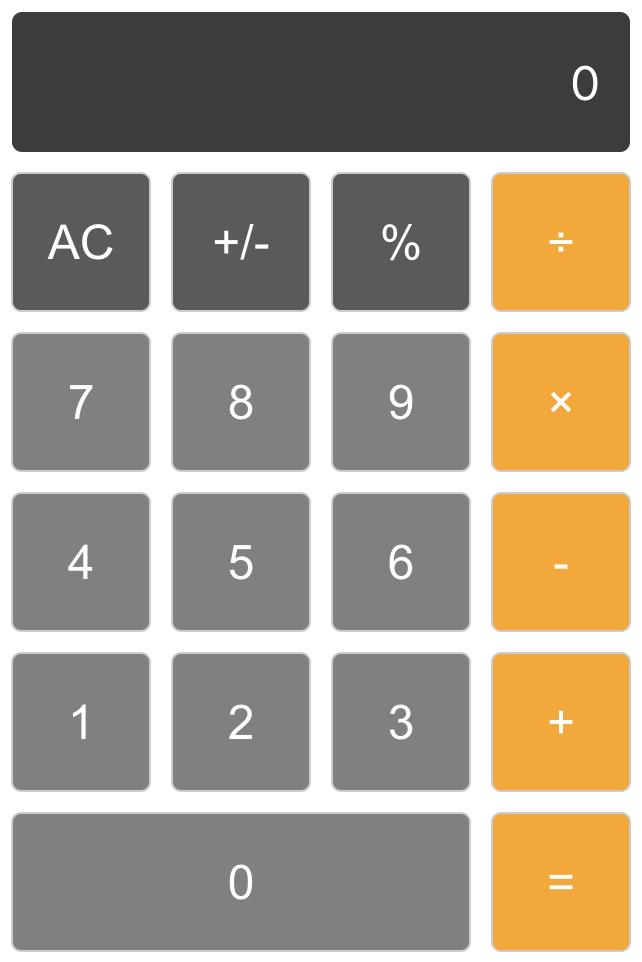

# Calculator

A simple calculator web application built with React.

## Description

The Calculator app allows users to perform basic arithmetic operations such as addition, subtraction, multiplication, and division. It provides a user-friendly interface for entering numbers and operators to perform calculations. The app uses React for the frontend logic.

  

## Features

- Addition, subtraction, multiplication, and division operations
- Clear button to reset the input

## Installation

Clone the repository, navigate to the project directory, install the dependencies, and start the development server using the following commands:

- git clone [https://github.com/your-username/calculator.git](https://github.com/fatemehkarami/Calculator-React.git)
- cd calculator
- npm install
- npm start
- Open your web browser and visit http://localhost:3000 to access the calculator app.

## Usage

- Enter numbers using the number buttons.
- Use the operation buttons (+, -, ×, ÷) to perform calculations.
- Press the equal button (=) to display the result.
- Click the AC button to clear the input.

## Contributing

Contributions are welcome! If you find any issues or have suggestions for improvements, please open an issue or submit a pull request.
